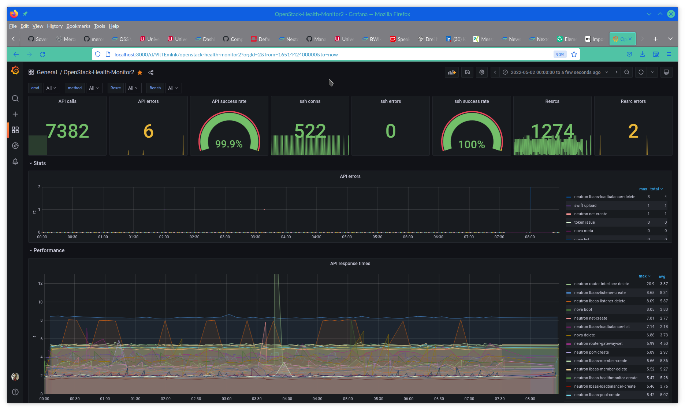

# Dashboards for the openstack-health-monitor

The openstack-health-monitor has a capability to report the results (errors
and execution times) to a local telegraf. This can be used to feed the results
to an influxdb which can feed grafana for dashboards.

This directory contains configuration files that can be used to setup a local
telegraf, influxdb and grafana setup. Note that this is purely for demonstration
purposes. In real life, you want to containerize the setup, put an SSL terminating
reverse proxy (ingress) in front of the grafana and think a bit about user
management. In particular, you would not want to expose the grafana with the
default config here to the internet without changing the admin password (`SCS_Admin`)
and enabling SSL.

For demo purposes on the other hand, running everything in the same VM (even
without containers) can be done -- I use ssh port forwarding to access the
Grafana in the host that runs the openstack-health-monitor.
`ssh -f -L 3000:localhost:3000 linux@host sleep 10800`
to get 3 hours of Grafana access via localhost:3000 protected by the
ssh acceess controls.

## The config files

* `telegraf.conf` is a default config file for [telegraf](https://www.influxdata.com/time-series-platform/telegraf/)
  from openSUSE 15.3 with minimal edits to work for us. The relevant pieces here are the
  `inputs.influxdb_listener` (on `:8186`) and the `outputs.influxdb` (to `localhost:8086`).
* `config.toml` is the default config file for [influxdb](https://www.influxdata.com/time-series-platform/)
  from openSUSE 15.3 without any edits.
* `grafana.ini` is the default config file for [grafana](https://grafana.com/)
  from openSUSE 15.3 with the admin password changed to `SCS_Admin` and `allow_signup` set to `false`.
* `openstack-health-dashboard.json` contains the dashboard exported to JSON and is the one piece here
  that has received significant work. Screenshots from the dashboard can be seen below.

## Screenshots

