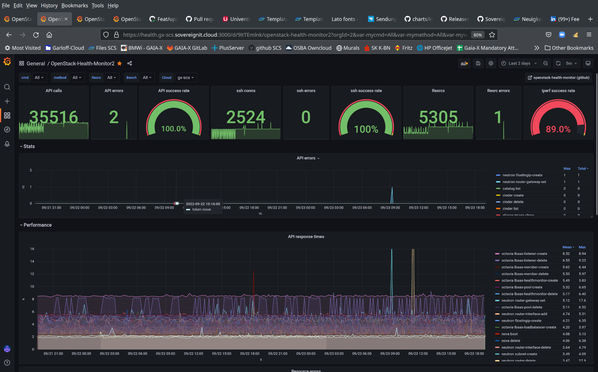
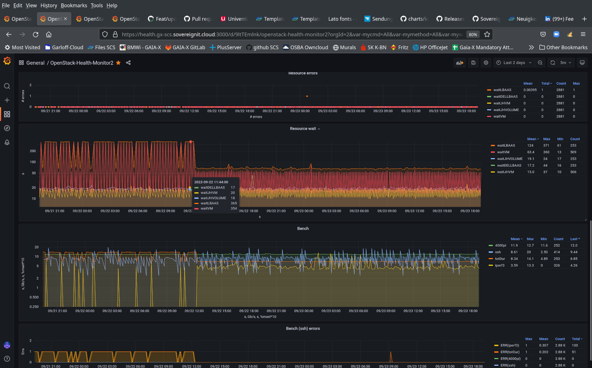

# Dashboards for the openstack-health-monitor

The openstack-health-monitor has a capability to report the results (errors
and execution times) to a local telegraf. This can be used to feed the results
to an influxdb which can feed grafana for dashboards.

This directory contains configuration files that can be used to setup a local
telegraf, influxdb and grafana setup. Note that this is for demonstration
purposes. You can disable the SSL setup and just use it locally by doing
an ssh port-forward of port 3000.

The default config in grafana.ini needs some work to complete the SSL setup
by having a DNS resolvable hostname (you can get one on sovereignit.cloud
from the SCS project if you want) and generate a valid cert for it.
You can also enable Viewer access for SovereignCloudStack org members on github.

The below config files are for an openSUSE 15.3/15.4 image -- grab one from
<https://kfg.images.obs-website.eu-de.otc.t-systems.com/> and install
telegraf, influxdb and grafana: `sudo zypper install telegraf influxdb grafana`.

## The config files

* `telegraf.conf` is a default config file for [telegraf](https://www.influxdata.com/time-series-platform/telegraf/)
  from openSUSE 15.3 with minimal edits to work for us. The relevant pieces here are the
  `inputs.influxdb_listener` (on `:8186`) and the `outputs.influxdb` (to `localhost:8086`).
  Put it into `/etc/telegraf/` (root:root 0644).
* `config.toml` is the default config file for [influxdb](https://www.influxdata.com/time-series-platform/)
  from openSUSE 15.3 without any edits. This belongs to to `/etc/influxdb/' (root:influxdb 0640).
* `grafana.ini` is the default config file for [grafana](https://grafana.com/)
  from openSUSE 15.3 with the admin password changed to `SCS_Admin` and `allow_signup` set to `false`.
  It belongs into `/etc/grafana/' (root:grafana 0640).
  The configuration is prepared to be exposed to the internet -- to do so, change the admin password,
  fill in a hostname that you control (or reach out to SCS for getting a registration on sovereignit.cloud),
  generate SSL certs (e.g. via Let's Encrypt) and put them to `/etc/grafana/health-fullchain.pem`
  and `health-key.pem` (belonging to group grafana and group-readable). Ensure to open up port 3000
  in your firewall config and security groups.
  Note that you can make all github users that belong to the SovereignCloudStack org
  getting Viewer access to the dashboards by adding a `client_id` and `client_secret` in the
  `[github.auth]` section that you request from the SCS github admins (github's oauth auth).
* `openstack-health-dashboard.json` contains the dashboard exported to JSON and is the one piece here
  that has received significant work. Screenshots from the dashboard can be seen below.
  To set up the dashboard, first create an influxdb datasource via `localhost:8086` connecting to
  the `telegraf` database and then import the JSON as dashboard.

## Screenshots

These screenshots show two days in the gx-scs development cloud from PlusServer,
nothing filtered out (all OpenStack services, all commands, all resource types,
all benchmarks).

There are a few things that can be observed, from most obvious to least obvious:

* Something happened on Sept 22, ~12:30: Suddenly deployment times for Loadbalancers and
  VMs dropped to consistently <~60s, while they varied before and went up to ~250s.
* At the same time, the iperf3 test stopped failing, while it only succeeded occasionally.
  The 89% iperf3 success rate is an average between the ~25% before the change and the 100%
  afterwards.
  (What you can't see from the dashboard, but could see in the logs: The reason for iperf3
   failing is that the installation of the iperf3 package through cloud-init does fail due
   to temporary failures in name resolution.)
* The long totalDuration test conincided with the iperf3 fails; only a single slow iteration
  happened after the change (which is really harmless in itself).
* You get roughly 5Mbps for 1vCPU instances east-west traffic and calculating 4000 digits
  of pi with bc takes ~10.7s on the used vCPUs. (This is about full speed on a good Skylake/
  Cascade Lake CPU. No signs of oversubscription really affecting you.)
* A single resource failure, where roughly 0:45 on Sept 23, a LoadBalancer failed to become
  active. (Very good!)
* Two API calls failed (out of 35500), both at 09:00 on Spet 23, neutron floating-ip-create
  and neutron router-gateway-set were hit. (This is a very good result!)
* Overall API performance is very consistent; the slowest API call is the lbaas-listener-create
  call which is still consistently < 9s. Only two notable spikes; one is the failed router-gateway-set
  call (17.6s) and a slow (28s) router-delete call. You can tell that the control plane of
  this cloud easily handles the control plane load that it's subjected to.
* No ssh errors, i.e. all VMs that were created successfully (which is all that were attempted
  to be created, could be connected to successfully, i.e. their network connections came
  up fine, cloud-init injected the meta-data with the ssh keys and the login succeeded).

TL;DR: This cloud was in serious trouble until Sep 22, ~12:30 (VMs and LBs taking a long
time to get deployed; iperf failing in the majority of cases) and since then works like
a charm.

Curious about this specific case?

OK, here's what was found: One compute node had serious networking trouble; VMs and
amphorae deployed there would often not report success with getting the network
port attached; a rescheduling after a few minutes explains the slowliness in VM
and LB deployment most of the time. It seems that after rescheduling the VM on
a different compute host, we observe the temporary DNS failure; there might be
a missing hook into OVN informing it that the VM was rescheduled somewhere else
and that it needs to change the DNS injection magic.
After the faulty host was removed from the scheduler, both the deployment times
and the DNS failures disappeared.
